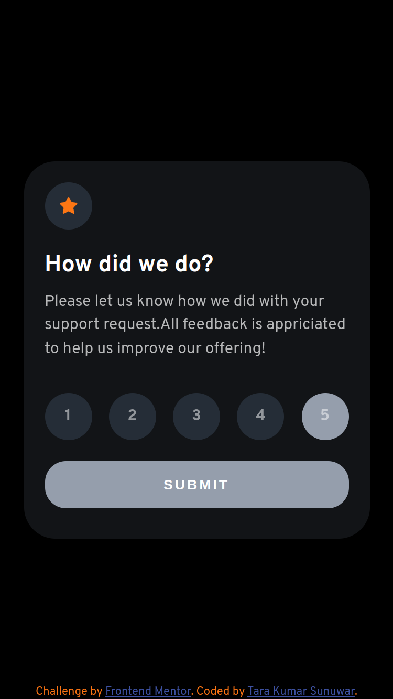

# Frontend Mentor - Interactive rating component solution

This is a solution to the [Interactive rating component challenge on Frontend Mentor](https://www.frontendmentor.io/challenges/interactive-rating-component-koxpeBUmI). Frontend Mentor challenges help you improve your coding skills by building realistic projects. 

## Table of contents

- [Overview](#overview)
  - [The challenge](#the-challenge)
  - [Screenshot](#screenshot)
  - [Links](#links)
- [My process](#my-process)
  - [Built with](#built-with)
  - [What I learned](#what-i-learned)
  - [Useful resources](#useful-resources)
- [Author](#author)

## Overview

### The challenge

Users should be able to:

- View the optimal layout for the app depending on their device's screen size
- See hover states for all interactive elements on the page
- Select and submit a number rating
- See the "Thank you" card state after submitting a rating

### Screenshot

### Links

- Solution URL: [GitHub](https://github.com/bipurna/interactive-rating-component.git)
- Live Site URL: [Add live site URL here](http://bipurna.github.com/interactive-rating-component)

## My process

### Built with

- Semantic HTML5 markup
- CSS custom properties
- Flexbox
- [React](https://reactjs.org/) - JS library
- [Styled Components](https://styled-components.com/) - For styles

**Note: These are just examples. Delete this note and replace the list above with your own choices**

### What I learn
- I could re-learn React statemanagement.
### Useful resources

- [React Doc](https://reactjs.org/docs/getting-started.html) - React doc is really helpful to understand it's eco system.
- [styled-components](https://styled-components.com/docs) - powerfull frameworks

## Author

- Website - [Tara Kumar Sunuwar](https://www.tarakumarsunuwar.com.np)
- Frontend Mentor - [@bipurna](https://www.frontendmentor.io/profile/bipurna)
- Twitter - [@bipurna_](https://www.twitter.com/bipurna_)

